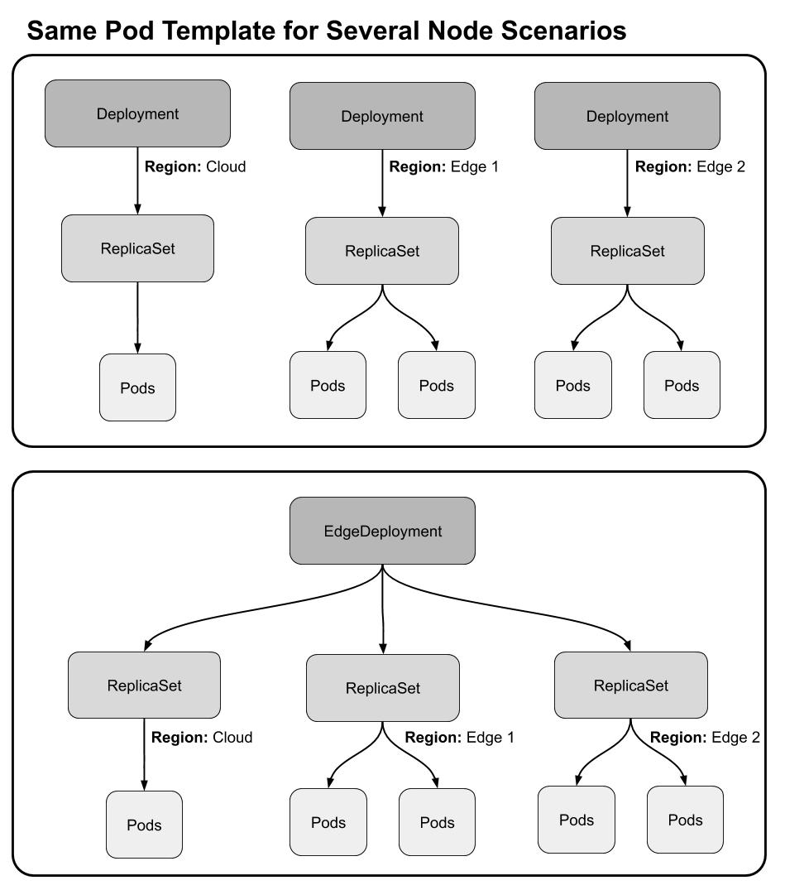
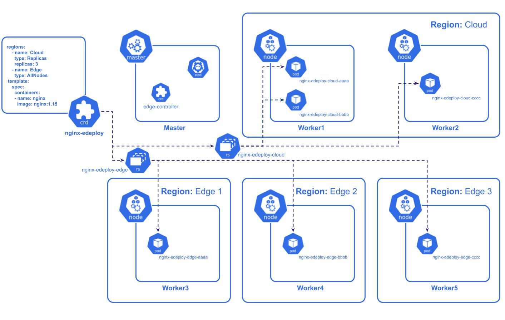

# GRIN edge-controller DEMO

GRIN edge-controller is a custom controller to Kubernetes focus on Edge/Fog scenarios. GRIN edge-controller provide a series of artifacts and a controller to a new type of deployment namely EdgeDeployment that implements a complete solution to lifecycle applications running integrate between several Edge Regions, simplified the management and enabling several network endpoints.

### Prerequisites

This tutorial was tested with the following software versions:

**Operating Systems**
* Ubuntu (18.04)
* macOS (10.14.x)
* Windows (10)

**Additional Packages**
* Kubernetes (>=1.14)

### Installing

If you want to test the edge-controller, please running the follow commands:

```bash
#clone repository
git clone https://github.com/GRIN-PUCRS/edge-k8s.git
cd edge-k8s

#add CRD definition to the current K8s cluster
kubectl apply -f files/edeploy-crd.yaml

#add edge-controller Pod to the current K8s cluster
kubectl apply -f files/edge-controller-dep.yaml

#add the ClusterRoleBinding to the Pod
kubectl apply -f files/edge-controller-rbac.yaml

#set labels on nodes
kubectl label nodes node1 region=edge-1
kubectl label nodes node2 region=edge-1
kubectl label nodes node3 region=edge-2

#running the edeployment example
kubectl apply -f files/ngnix-edeploy.yaml

#check edge deployments create through the kubectl
kubectl get edeploy -o wide
```

## Deployment

Image 1


Image 2


## Contributing

Please read [CONTRIBUTING.md]() for details on our code of conduct, and the process for submitting pull requests to us.

## Authors

* **Luis Knob** - [Github](https://github.com/luisdknob)

## License

This project is licensed under the Apache License - see the [LICENSE](LICENSE) file for details

## Acknowledgments
